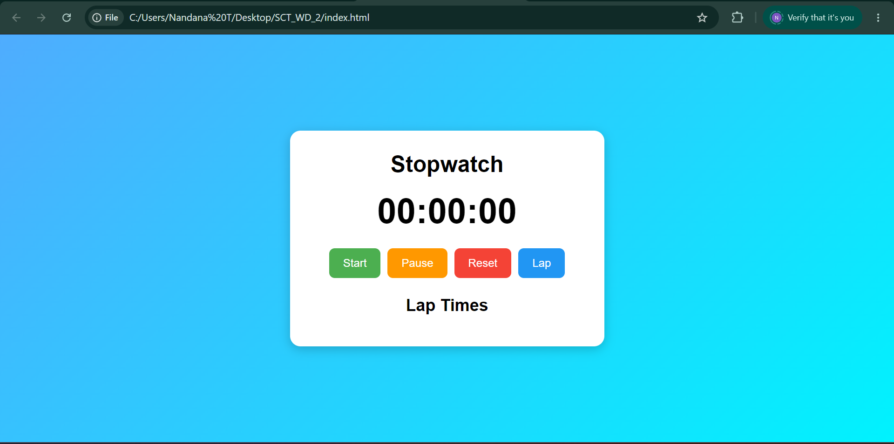
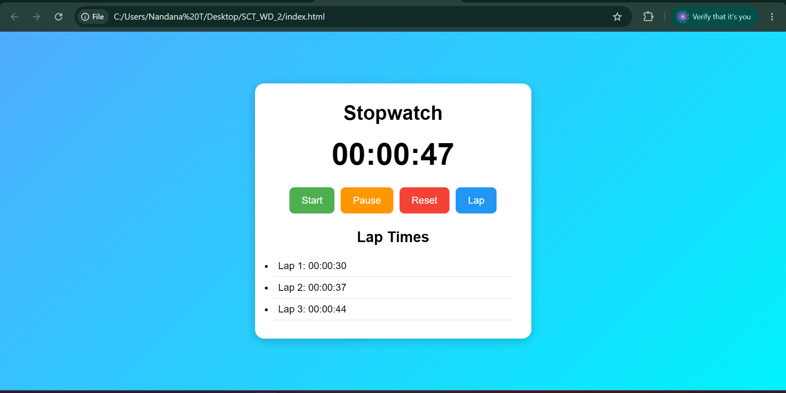

# SCT_WD_2 - Stopwatch Web Application

## Description

This project is a Stopwatch Web Application developed as part of the SkillCraft Technology Web Development Internship.

The application allows users to:

- Start the stopwatch
- Pause the stopwatch
- Reset the stopwatch
- Record lap times
- View recorded lap times

## Technologies Used

- HTML
- CSS
- JavaScript

## Features

- User-friendly interface
- Real-time stopwatch functionality
- Start, Pause and Reset controls
- Lap time tracking
- Responsive design

## Project Structure

```
SCT_WD_2/
│
├── index.html
├── style.css
├── script.js
├── README.md
└── screenshots/
    ├── initial-screen.png
    ├── running-stopwatch.png
    └── lap-times.png
```

## Screenshots

### Initial Screen



### Stopwatch Running


### Lap Times



## Internship Task

SkillCraft Technology Web Development Internship

Task 02 - Stopwatch Web Application

## Author

Nandana T
